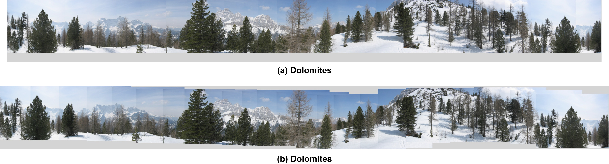
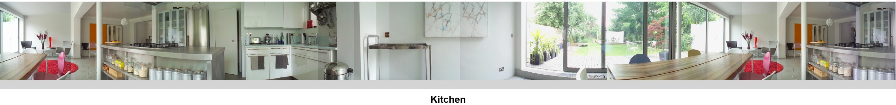

# Camera Calibration and Panorama Stitching
This repo caontains a C++ code for camera calibration and panoramic image representation. For more information please refer to the full report [here](https://drive.google.com/file/d/1NPWsrzrCnMujzLPbZrOxii73qNF6kOVR/view?usp=sharing) 

Panoramic images are generally obtained by merging several narrow view adjacent images of the same scene taken by rotating a camera along the vertical and/or the horizontal axis. Stitching these images produces a wide view image of the scene as if it was taken by a large Field Of View (FOV) camera.

This repo contains the implementation of a C ++ panorama stitching algorithm based on a simple estimation of camera shift between frames projected in cylindrical space which reduces the problem into a simple translation given that the images are taken with a fixed camera along the horizontal axis (little or no tilt), this however requires the FOV of the camera to be known thus a calibration process needs to be done.

## Problem Formulation
First, a set of images are taken by placing a camera on a tripod and rotate it along the vertical access taking at each time overlapping pictures of the scene, another possible way is to slide the camera along the horizontal axis by using appropriate equipment or by simply holding it and moving roughly along a line parallel to the scene. However, unwanted shaking and displacements caused by human hands or even improperly set tripod may affect the final merging result. Second, keypoints are extracted and matched along every successive couple of images, which allow to estimate the relative camera movement between both frames by comparing the positions of each matched couple of keypoints. Third, and depending on the stitching strategy to be used, the estimated movement can be a simple translation or a homography which are used to align and merge the full sequence of images together in a relatively seamless way.

## Samples

